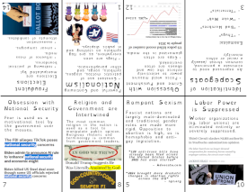

+++
date = '2025-01-14T09:47:50-08:00'
draft = false
title = '14 Ways to Spot Fascism'
+++

| Side A | Side B |
|:---:|:---:|
|  |  |

## [Download Zine](14-ways-to-spot-fascism.pdf)
##### [Video instructions for printing/assembling zine](https://www.tiktok.com/@decolonizationcoven/video/7443304260529360171) _*(see 1:23 timestamp)_

### The Inspiration
This contents of this zine are based on the work by Dr. Lawrence Britt, ["The 14 Characteristics of Fascism"](https://ratical.org/ratville/CAH/fasci14chars.html) _(first published under the title **"Fascism Anyone?"** in the Spring 2003 issue **Free Inquiry** magazine, p.20)_.

My goal was to provide a contextually relevant interpretation of Dr. Britt's work to aid folks within the imperial core _(especially the United States)_ to recognize the various elements of fascism at work in their everyday lives.

### The Disclaimer
While the examples included in this publication meet the prerequisite for fascistic tendencies, **they are by no means meant to serve as a timeless standard**.

This is why it's vitally important to talk with your friends, family, and the folks in your community to keep a collective eye out for new ways in which these characteristics might manifest in the future.

### The Work
**Template:** This 14-page zine was designed using the [GNU Image Manipulation Program](https://www.gimp.org/) (also known as "GIMP") and a variant of the free templates available on [Decolonization Coven](https://decolonizationcoven.com/store).

**Accessability:** In order to aid those with reading-adjacent disabilities, the [OpenDyslexic font](https://antijingoist.itch.io/opendyslexic) _(created by **[antijingoist](https://github.com/antijingoist)**)_ was selected as this publication's primary typeface.

**License:** _**"14 Ways To Spot Fascism"**_ by **Dakota Raine** is marked with _[CC0 1.0 Universal ](https://creativecommons.org/publicdomain/zero/1.0/?ref=chooser-v1)_.