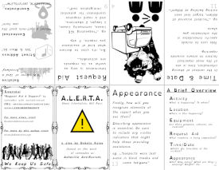
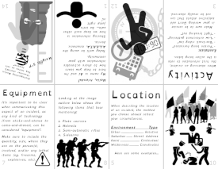

+++
date = '2025-01-27T09:47:50-08:00'
draft = false
title = 'A.L.E.R.T.A. - Share Information, Not Panic'
+++

| Side A | Side B |
|:---:|:---:|
|  |  |

## [Download Zine](alerta-share-information-not-panic.pdf)
##### [Video instructions for printing/assembling zine](https://www.tiktok.com/@decolonizationcoven/video/7443304260529360171) _*(see 1:23 timestamp)_

### The Inspiration
The contents of this zine are based on the work of comrades w/ **Ashville AntiRacism**, ["Request Aid & Support"](https://twitter.com/avlantiracism/status/1325198282298191872).

My goal for this publication is to help comrades communicate information in actionable ways without subjecting folks to speculation and pressumptive thinking that creates fear instead of community.

### The Disclaimer
This is not meant to be a replacement for more thorough workshops you may be able to find in your community from more experienced, local activists. It is only a communication tool (like the S.A.L.U.T.E. mnemonic), meant to help neighbors keep each other safe.

### The Work
**Template:** This 14-page zine was designed using the [GNU Image Manipulation Program](https://www.gimp.org/) (also known as "GIMP") and a variant of the free templates available on [Decolonization Coven](https://decolonizationcoven.com/store).

**Accessability:** In order to aid those with reading-adjacent disabilities, the [OpenDyslexic font](https://antijingoist.itch.io/opendyslexic) _(created by **[antijingoist](https://github.com/antijingoist)**)_ was selected as this publication's primary typeface.

**License:** _**"A.L.E.R.T.A. - Share Information, Not Panic"**_ by **Dakota Raine** is marked with _[CC0 1.0 Universal ](https://creativecommons.org/publicdomain/zero/1.0/?ref=chooser-v1)_.